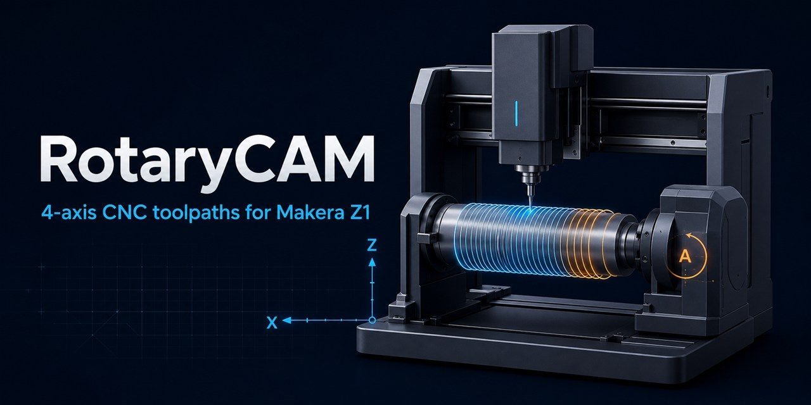

<p align="center">
  
</p>

<h1 align="center">RotaryCAM</h1>

<p align="center">
  Safety-first volumetric CAM and desktop preview for coordinated X/Y/Z/A machining.
</p>

RotaryCAM imports closed STL/OBJ solids, builds a sparse XYZ target and stock volume,
plans accessible four-axis tool poses, validates swept tool/machine collisions, simulates
the cutter's real swept volume, and emits inverse-time G93 blocks only for a machine
profile that explicitly certifies them.

> **CNC safety:** generated G-code is not proof of controller or machine compatibility.
> Review the exact profile, simulate the program independently, perform a dry-run above
> the work, and verify workholding, offsets, tools, feeds and every controller modal state.

## Current v2 workflow

- X, Y, Z and unwrapped A are independent coordinates in `MachinePose`; one motion block
  may change all four axes, but an axis is not forced to move when it is unnecessary.
- Stock and target use one sparse XYZ voxel lattice. Requested tolerance is never relaxed
  silently: planning stops when the configured hard memory budget cannot guarantee it.
- Disjoint closed components form a union. Fully nested shells alternate solid and void,
  so cavities can be represented. Open or inconsistent meshes remain inspectable but
  cannot be planned.
- Flat, ball and tapered cutters include the cutter, non-cutting body, shank and holder.
  Legacy tools without measured stickout and holder remain preview-only.
- Machine collision geometry consists of measured boxes, cylinders and frustums attached
  to fixed, rotary or spindle frames. Chuck, jaws, tailstock, platter, spindle, holder and
  supports must be complete before export.
- Simulation subtracts only the actual cutting solid. Gouges, collisions, detached stock,
  stale evidence and unknown retention connectivity are always blocking.
- G93 inverse-time output is disabled unless the profile explicitly certifies simultaneous
  XYZA and inverse-time support. G94 is restored before program completion.

The v2 desktop and CLI export paths do not fall back to the historical radial XZA
postprocessor.

## Makera Z1 community reference

The bundled `makera_z1_community_profile()` is deliberately incomplete and unverified.
Makera's public fourth-axis page describes a rotary-work accessory, but does not establish
the exact pivot in G54, Y travel, A convention, controller G93 semantics, axis acceleration
limits, fixture envelopes or a complete machine assembly. The bundled profile therefore
supports preview and data entry only; it cannot export XYZA G-code.

The published [Makera Z1 machine page](https://global.makera.com/products/makera-z1-desktop-cnc)
and [fourth-axis module page](https://global.makera.com/products/makera-z1-4th-axis-module)
are useful measurement references, not controller certification. RotaryCAM makes no claim
that generic G-code is compatible with a Makera controller.

The bundled profile also preserves a small set of community observations (controller
firmware and displayed coordinates) as informational metadata. They are deliberately not
used as travel, G54, pivot, accuracy or controller-capability inputs. The measured
Ø16 × 23 mm spindle-nose/quick-change envelope is only an editable tool-dialog prefill;
stickout remains unset until it is measured from each tool tip to the nose face after that
tool's calibration. See [Makera Z1 measurement status](docs/makera-z1-measurements.md).

To make a profile export-eligible, independently measure and review at least:

- X/Y/Z travel, A direction and mechanical zero;
- rotary pivot, spindle axis, G54 origin and setup transform;
- X/Y/Z/A maximum velocity and acceleration;
- chuck, jaws, tailstock, platter, spindle, supports and other fixture envelopes;
- simultaneous XYZA interpolation and G93 behavior on the exact controller/firmware.

Editing a profile in the desktop application always clears `profile_verified`. The UI has
no control that grants verification.

## Setup

Install `uv`, then provision Python 3.12 and the optional desktop dependencies:

```powershell
uv python install 3.12
uv sync --extra dev --extra ui
```

## Command line

```powershell
uv run rotarycam inspect model.stl
uv run rotarycam sample project.json
uv run rotarycam plan project.json
uv run rotarycam simulate project.json
uv run rotarycam export project.json output.nc
```

If accessibility analysis reports only unreachable residual material, the CLI prints its
SHA-256 digest. A deliberate partial export repeats that exact evidence:

```powershell
uv run rotarycam export project.json output.nc --ack-inaccessible <digest>
```

The digest binds the target, tool assemblies, machine, accessibility settings and plan.
Any relevant change makes it stale. This flag can never acknowledge a gouge, collision,
detached part, incomplete profile, missing G93 certification or another critical error.

## Desktop preview

```powershell
uv run rotarycam-gui
```

The desktop application provides:

- sparse-volume tolerance, hard memory budget and brick-size settings;
- tool stickout and holder measurements;
- Y travel, pivot, A zero, spindle direction, G54 origin, per-axis dynamics and controller
  capability fields;
- validated JSON entry for measured box, cylinder and frustum machine/fixture envelopes;
- independent part, stock, measured-machine, toolpath and residual scene layers;
- G54 TCP polylines for every planned pass, including the unwrapped A value on each point;
- a render-only A0 transform of part volumes into measured G54 for the combined machine view;
- a precise preview-only list when machine measurements or verification are missing.

The export dialog appears only for a current simulated plan and a verified profile. If the
sole acknowledgeable issue is inaccessible residue, it shows voxel count, maximum error,
typed causes and the current digest. Confirmation applies to one export attempt only and is
cleared after success, refusal or failure. A stale digest is rejected by the engine.

## Coordinate and geometry conventions

- Internal units are millimetres, degrees, mm/min and rpm.
- The part frame is distinct from G54 `MachinePose(x, y, z, a)`.
- X is the rotary-axis direction and A is continuous/unwrapped inside operations.
- `T_machine_part(A) = T_rotary_zero × RotationX(direction × A) × T_setup`.
- Stock and target volumes share the same canonical `(X, Y, Z)` lattice.
- Sparse bricks are traversed deterministically in lexicographic XYZ order.

## Project migration

Project, machine-library and tool-library schema v2 use only the XYZA pipeline. Loading a
v1 document migrates it in memory, removes generated operations, clears profile verification,
converts radial supports to retention volumes, and marks unknown Y/pivot/assembly/holder
measurements as missing. The source file is not changed until save; save creates a `.v1.bak`
backup and writes v2 atomically.

## Development

```powershell
uv run pytest
uv run ruff check .
uv run mypy src/rotarycam
git diff --check
```

Domain and numerical code do not import the GUI. PySide6/PyVistaQt belong to the `ui`
extra, and offscreen tests inject a fake plotter rather than rendering native VTK.

## Community and license

- Read [CONTRIBUTING.md](CONTRIBUTING.md) before opening a pull request.
- Use [GitHub Issues](https://github.com/kaa-serpent/3dCamSlicer/issues) for reproducible bugs.
- Report security-sensitive findings according to [SECURITY.md](SECURITY.md).

RotaryCAM is distributed under the [BSD 3-Clause License](LICENSE).
